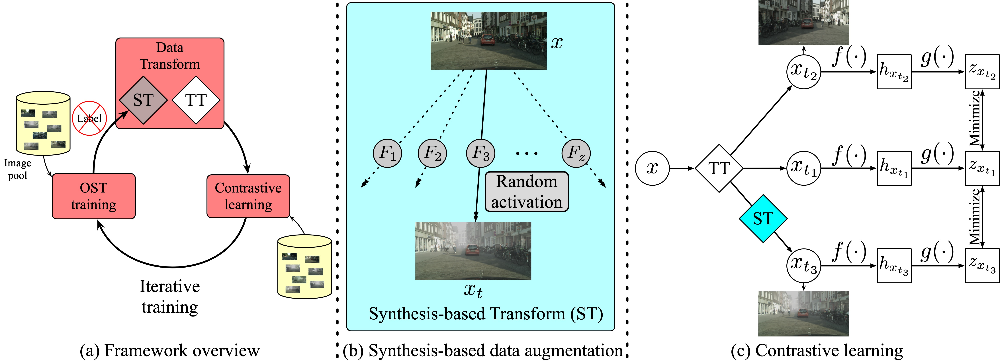
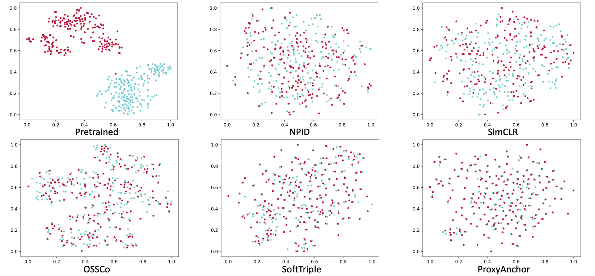

# ZsCo

A PyTorch implementation of ZsCo based on PG 2021
paper [Zero-Shot Cross-Domain Image Retrieval Through An Alternate One-Shot Translation and Contrast Learning]().



## Requirements

- [Anaconda](https://www.anaconda.com/download/)
- [PyTorch](https://pytorch.org)

```
conda install pytorch=1.8.1 torchvision cudatoolkit -c pytorch -c nvidia
```

- [Pytorch Metric Learning](https://kevinmusgrave.github.io/pytorch-metric-learning/)

```
pip install pytorch-metric-learning
```

- [Faiss](https://faiss.ai)

```
conda install -c pytorch faiss-gpu
```

- [THOP](https://github.com/Lyken17/pytorch-OpCounter)

```
pip install thop
```

- bidict

```
pip install bidict
```

## Dataset

[PACS](https://domaingeneralization.github.io), [Office-31](https://people.eecs.berkeley.edu/~jhoffman/domainadapt) and
[Office-Home](https://www.hemanthdv.org/officeHomeDataset.html) datasets are used in this repo, you could download these
datasets from official websites, or download them from [MEGA](https://mega.nz/folder/M8RFgCzL#nLK35A45QVLCTFqqRzc3vQ).
The data should be rearranged, please refer the paper to acquire the details of `train/val` split. The data directory
structure is shown as follows:

 ```
pacs
    ├── art (art images)
        ├── train
            ├── dog
                pic_001.jpg
                ...    
            ...  
        ├── val
            ├── horse
                pic_001.jpg
                ...    
            ...  
    ├── cartoon (cartoon images)
        same structure as art
        ...   
    ...        
office_31
    same structure as pacs
office_home
    same structure as pacs
```

## Usage

```
python main.py or comp.py --data_name office_home
optional arguments:
# common args
--data_root                   Datasets root path [default value is 'data']
--data_name                   Dataset name [default value is 'pacs'](choices=['pacs', 'office_31', 'office_home'])
--method_name                 Compared method name [default value is 'zsco'](choices=['zsco', 'simsiam', 'simclr', 'npid', 'proxyanchor', 'softtriple'])
--hidden_dim                  Hidden feature dim for projection head [default value is 512]
--temperature                 Temperature used in softmax [default value is 0.1]
--batch_size                  Number of images in each mini-batch [default value is 32]
--total_iter                  Number of bp to train [default value is 10000]
--save_root                   Result saved root path [default value is 'result']
# args for zsco
--style_num                   Number of used styles [default value is 8]
--gan_iter                    Number of bp to train gan model [default value is 4000]
--rounds                      Number of round to train whole model [default value is 5]
```

For example, to train `npid` on `office_home` dataset:

```
python comp.py --method_name npid --data_name office_home --batch_size 64
```

to train `zsco` on `pacs` dataset, with `16` random selected styles:

```
python main.py --method_name zsco --data_name pacs --style_num 16
```

## Benchmarks

The models are trained on one NVIDIA GTX TITAN (12G) GPU. `Adam` is used to optimize the model, `lr` is `1e-3`
and `weight decay` is `1e-6`. `batch size` is `32` for `zsco`, `simsiam` and `simclr`, `64` for `npid`, `proxyanchor`
and `softtriple`. `lr` is `2e-4` and `betas` is `(0.5, 0.999)` for GAN, other hyper-parameters are the default values.

### PACS

<table>
<thead>
  <tr>
    <th>Method</th>
    <th colspan="2">Art &lt;--&gt; Cartoon</th>
    <th colspan="2">Art &lt;--&gt; Photo</th>
    <th colspan="2">Art &lt;--&gt; Sketch</th>
    <th colspan="2">Cartoon &lt;--&gt; Photo</th>
    <th colspan="2">Cartoon &lt;--&gt; Sketch</th>
    <th colspan="2">Photo &lt;--&gt; Sketch</th>
    <th>Download</th>
  </tr>
</thead>
<tbody>
  <tr>
    <td align="center">NPID</td>
    <td align="center">35.8</td>
    <td align="center">35.0</td>
    <td align="center">37.1</td>
    <td align="center">36.4</td>
    <td align="center">39.4</td>
    <td align="center">26.2</td>
    <td align="center">36.0</td>
    <td align="center">35.8</td>
    <td align="center">47.4</td>
    <td align="center">38.9</td>
    <td align="center">40.7</td>
    <td align="center">35.8</td>
    <td align="center"><a href="https://pan.baidu.com/s/1PWLOBKWb8gUUibXOX9OQyA">hu2k</a></td>
  </tr>
  <tr>
    <td align="center">SimCLR</td>
    <td align="center">36.9</td>
    <td align="center">37.4</td>
    <td align="center">42.9</td>
    <td align="center">42.6</td>
    <td align="center">28.2</td>
    <td align="center">32.1</td>
    <td align="center">39.4</td>
    <td align="center">36.8</td>
    <td align="center">34.5</td>
    <td align="center">41.5</td>
    <td align="center">26.8</td>
    <td align="center">28.4</td>
    <td align="center"><a href="https://pan.baidu.com/s/1PWLOBKWb8gUUibXOX9OQyA">hu2k</a></td>
  </tr>
  <tr>
    <td align="center">SimSiam</td>
    <td align="center">37.5</td>
    <td align="center">37.8</td>
    <td align="center">40.3</td>
    <td align="center">40.7</td>
    <td align="center">33.4</td>
    <td align="center">40.2</td>
    <td align="center">40.0</td>
    <td align="center">37.5</td>
    <td align="center">39.5</td>
    <td align="center">40.3</td>
    <td align="center">33.5</td>
    <td align="center">27.4</td>
    <td align="center"><a href="https://pan.baidu.com/s/1PWLOBKWb8gUUibXOX9OQyA">hu2k</a></td>
  </tr>
  <tr>
    <td align="center">SoftTriple</td>
    <td align="center">46.2</td>
    <td align="center">48.7</td>
    <td align="center">56.5</td>
    <td align="center">59.4</td>
    <td align="center">37.6</td>
    <td align="center">35.2</td>
    <td align="center">57.6</td>
    <td align="center">57.2</td>
    <td align="center">48.0</td>
    <td align="center">48.6</td>
    <td align="center">43.8</td>
    <td align="center">52.5</td>
    <td align="center"><a href="https://pan.baidu.com/s/1PWLOBKWb8gUUibXOX9OQyA">hu2k</a></td>
  </tr>
  <tr>
    <td align="center">ProxyAnchor</td>
    <td align="center">47.7</td>
    <td align="center">48.6</td>
    <td align="center">56.9</td>
    <td align="center">57.2</td>
    <td align="center">49.1</td>
    <td align="center">46.9</td>
    <td align="center">50.3</td>
    <td align="center">49.3</td>
    <td align="center">49.8</td>
    <td align="center">49.6</td>
    <td align="center">48.6</td>
    <td align="center">40.3</td>
    <td align="center"><a href="https://pan.baidu.com/s/1PWLOBKWb8gUUibXOX9OQyA">hu2k</a></td>
  </tr>
  <tr>
    <td align="center">ZsCo</td>
    <td align="center"><b>48.6</b></td>
    <td align="center"><b>83.7</b></td>
    <td align="center"><b>93.1</b></td>
    <td align="center"><b>50.3</b></td>
    <td align="center"><b>86.4</b></td>
    <td align="center"><b>94.6</b></td>
    <td align="center"><b>45.9</b></td>
    <td align="center"><b>79.8</b></td>
    <td align="center"><b>89.0</b></td>
    <td align="center"><b>66.1</b></td>
    <td align="center"><b>88.7</b></td>
    <td align="center"><b>94.0</b></td>
    <td align="center"><a href="https://pan.baidu.com/s/1PWLOBKWb8gUUibXOX9OQyA">hu2k</a></td>
  </tr>
</tbody>
</table>

### Office-31

<table>
<thead>
  <tr>
    <th>Method</th>
    <th colspan="2">Amazon &lt;--&gt; DSLR</th>
    <th colspan="2">Amazon &lt;--&gt; Webcam</th>
    <th colspan="2">DSLR &lt;--&gt; Webcam</th>
    <th>Download</th>
  </tr>
</thead>
<tbody>
  <tr>
    <td align="center">NPID</td>
    <td align="center">49.3</td>
    <td align="center">82.4</td>
    <td align="center">88.0</td>
    <td align="center">41.4</td>
    <td align="center">68.8</td>
    <td align="center">99.0</td>
    <td align="center"><a href="https://pan.baidu.com/s/1PWLOBKWb8gUUibXOX9OQyA">hu2k</a></td>
  </tr>
  <tr>
    <td align="center">SimCLR</td>
    <td align="center">49.3</td>
    <td align="center">82.4</td>
    <td align="center">88.0</td>
    <td align="center">41.4</td>
    <td align="center">68.8</td>
    <td align="center">99.0</td>
    <td align="center"><a href="https://pan.baidu.com/s/1PWLOBKWb8gUUibXOX9OQyA">hu2k</a></td>
  </tr>
  <tr>
    <td align="center">SimSiam</td>
    <td align="center">49.3</td>
    <td align="center">82.4</td>
    <td align="center">88.0</td>
    <td align="center">41.4</td>
    <td align="center">68.8</td>
    <td align="center">93.6</td>
    <td align="center"><a href="https://pan.baidu.com/s/1PWLOBKWb8gUUibXOX9OQyA">hu2k</a></td>
  </tr>
  <tr>
    <td align="center">SoftTriple</td>
    <td align="center">49.3</td>
    <td align="center">82.4</td>
    <td align="center">88.0</td>
    <td align="center">41.3</td>
    <td align="center">82.8</td>
    <td align="center">93.6</td>
    <td align="center"><a href="https://pan.baidu.com/s/1PWLOBKWb8gUUibXOX9OQyA">hu2k</a></td>
  </tr>
  <tr>
    <td align="center">ProxyAnchor</td>
    <td align="center">49.3</td>
    <td align="center">82.4</td>
    <td align="center">88.0</td>
    <td align="center">41.4</td>
    <td align="center">82.8</td>
    <td align="center">93.6</td>
    <td align="center"><a href="https://pan.baidu.com/s/1PWLOBKWb8gUUibXOX9OQyA">hu2k</a></td>
  </tr>
  <tr>
    <td align="center">ZsCo</td>
    <td align="center"><b>48.6</b></td>
    <td align="center"><b>83.7</b></td>
    <td align="center"><b>93.1</b></td>
    <td align="center"><b>88.7</b></td>
    <td align="center"><b>94.0</b></td>
    <td align="center"><b>94.0</b></td>
    <td align="center"><a href="https://pan.baidu.com/s/1PWLOBKWb8gUUibXOX9OQyA">hu2k</a></td>
  </tr>
</tbody>
</table>

### Office-Home

<table>
<thead>
  <tr>
    <th>Method</th>
    <th colspan="2">Art &lt;--&gt; Clipart</th>
    <th colspan="2">Art &lt;--&gt; Product</th>
    <th colspan="2">Art &lt;--&gt; Real</th>
    <th colspan="2">Clipart &lt;--&gt; Product</th>
    <th colspan="2">Clipart &lt;--&gt; Real</th>
    <th colspan="2">Product &lt;--&gt; Real</th>
    <th>Download</th>
  </tr>
</thead>
<tbody>
  <tr>
    <td align="center">NPID</td>
    <td align="center">49.3</td>
    <td align="center">82.4</td>
    <td align="center">88.0</td>
    <td align="center">41.4</td>
    <td align="center">68.8</td>
    <td align="center">99.0</td>
    <td align="center">38.0</td>
    <td align="center">80.8</td>
    <td align="center">94.1</td>
    <td align="center">41.3</td>
    <td align="center">82.8</td>
    <td align="center">93.6</td>
    <td align="center"><a href="https://pan.baidu.com/s/1PWLOBKWb8gUUibXOX9OQyA">hu2k</a></td>
  </tr>
  <tr>
    <td align="center">SimCLR</td>
    <td align="center">49.3</td>
    <td align="center">82.4</td>
    <td align="center">88.0</td>
    <td align="center">41.4</td>
    <td align="center">68.8</td>
    <td align="center">99.0</td>
    <td align="center">38.0</td>
    <td align="center">80.8</td>
    <td align="center">94.1</td>
    <td align="center">41.3</td>
    <td align="center">82.8</td>
    <td align="center">93.6</td>
    <td align="center"><a href="https://pan.baidu.com/s/1PWLOBKWb8gUUibXOX9OQyA">hu2k</a></td>
  </tr>
  <tr>
    <td align="center">SimSiam</td>
    <td align="center">49.3</td>
    <td align="center">82.4</td>
    <td align="center">88.0</td>
    <td align="center">41.4</td>
    <td align="center">68.8</td>
    <td align="center">99.0</td>
    <td align="center">38.0</td>
    <td align="center">80.8</td>
    <td align="center">94.1</td>
    <td align="center">41.3</td>
    <td align="center">82.8</td>
    <td align="center">93.6</td>
    <td align="center"><a href="https://pan.baidu.com/s/1PWLOBKWb8gUUibXOX9OQyA">hu2k</a></td>
  </tr>
  <tr>
    <td align="center">SoftTriple</td>
    <td align="center">49.3</td>
    <td align="center">82.4</td>
    <td align="center">88.0</td>
    <td align="center">41.4</td>
    <td align="center">68.8</td>
    <td align="center">99.0</td>
    <td align="center">38.0</td>
    <td align="center">80.8</td>
    <td align="center">94.1</td>
    <td align="center">41.3</td>
    <td align="center">82.8</td>
    <td align="center">93.6</td>
    <td align="center"><a href="https://pan.baidu.com/s/1PWLOBKWb8gUUibXOX9OQyA">hu2k</a></td>
  </tr>
  <tr>
    <td align="center">ProxyAnchor</td>
    <td align="center">49.3</td>
    <td align="center">82.4</td>
    <td align="center">88.0</td>
    <td align="center">41.4</td>
    <td align="center">68.8</td>
    <td align="center">99.0</td>
    <td align="center">38.0</td>
    <td align="center">80.8</td>
    <td align="center">94.1</td>
    <td align="center">41.3</td>
    <td align="center">82.8</td>
    <td align="center">93.6</td>
    <td align="center"><a href="https://pan.baidu.com/s/1PWLOBKWb8gUUibXOX9OQyA">hu2k</a></td>
  </tr>
  <tr>
    <td align="center">ZsCo</td>
    <td align="center"><b>48.6</b></td>
    <td align="center"><b>83.7</b></td>
    <td align="center"><b>93.1</b></td>
    <td align="center"><b>50.3</b></td>
    <td align="center"><b>86.4</b></td>
    <td align="center"><b>94.6</b></td>
    <td align="center"><b>45.9</b></td>
    <td align="center"><b>79.8</b></td>
    <td align="center"><b>89.0</b></td>
    <td align="center"><b>66.1</b></td>
    <td align="center"><b>88.7</b></td>
    <td align="center"><b>94.0</b></td>
    <td align="center"><a href="https://pan.baidu.com/s/1PWLOBKWb8gUUibXOX9OQyA">hu2k</a></td>
  </tr>
</tbody>
</table>

### T-SNE


