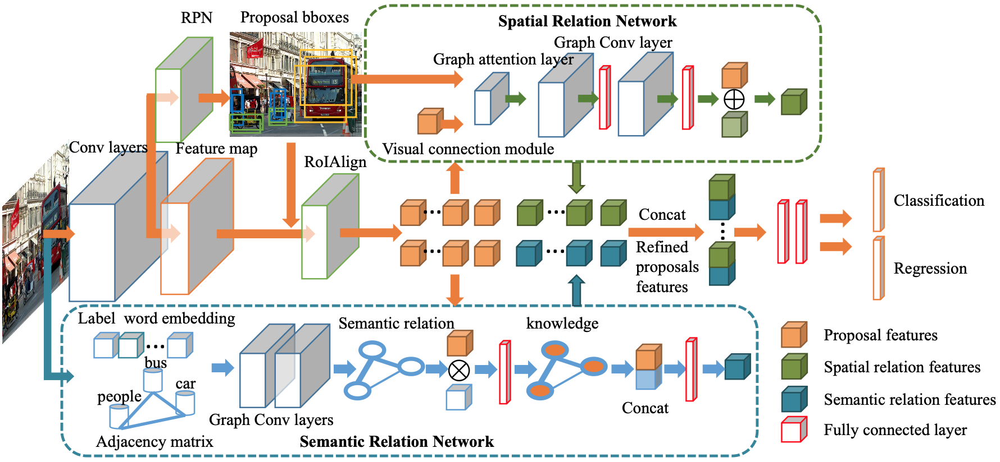

# Relation R-CNN
A PyTorch implementation of Relation R-CNN based on the paper [Improving Object Detection with Relation Mining Network]().



## Requirements
- [Anaconda](https://www.anaconda.com/download/)
- [PyTorch](https://pytorch.org)
```
conda install pytorch torchvision cudatoolkit=10.2 -c pytorch
```
- detectron2
```
python -m pip install detectron2 -f \
  https://dl.fbaipublicfiles.com/detectron2/wheels/cu102/torch1.5/index.html
```
- opencv
```
pip install opencv-python
```

## Datasets
`PASCAL VOC 2007` and `MS COCO 2017` datasets are used in this repo. The datasets are assumed to exist in a directory 
specified by the environment variable `DETECTRON2_DATASETS`. You can set the location for these datasets by 
`export DETECTRON2_DATASETS=/path/to/datasets`. The dataset structure should be organized as 
[this](https://github.com/facebookresearch/detectron2/tree/master/datasets) described.

Before training, the pre-trained backbone models ([ResNet50](https://hangzh.s3.amazonaws.com/encoding/models/resnet50-25c4b509.zip), 
[ResNet101](https://hangzh.s3.amazonaws.com/encoding/models/resnet101-2a57e44d.zip) and 
[ResNet152](https://hangzh.s3.amazonaws.com/encoding/models/resnet152-0d43d698.zip)) on ImageNet should be downloaded 
and unzipped into `epochs`.  

## Training
To train a model, run
```bash
python train_net.py --config-file <config.yaml>
```

For example, to launch end-to-end EMANet training with `ResNet-50` backbone for `coco` dataset on 8 GPUs, one should execute:
```bash
python train_net.py --config-file configs/r50_coco.yaml --num-gpus 8
```

## Evaluation
Model evaluation can be done similarly:
```bash
python train_net.py --config-file configs/r50_coco.yaml --num-gpus 8 --eval-only MODEL.WEIGHTS epochs/model.pth
```

## Results
There are some difference between this implementation and official implementation:
1. The image sizes of `Multi-Scale Training` are (640, 672, 704, 736, 768, 800) for `coco` dataset;
2. The image sizes of `Multi-Scale Training` are (800, 832, 864, 896, 928, 960, 992, 1024) for `cityscapes` dataset;
3. No `RandomCrop` used;
4. Learning rate policy is `WarmupCosineLR`.

### COCO
<table>
	<tbody>
		<!-- START TABLE -->
		<!-- TABLE HEADER -->
		<th>Name</th>
		<th>train time (s/iter)</th>
		<th>inference time (s/im)</th>
		<th>train mem (GB)</th>
		<th>PA</br>%</th>
		<th>mean PA %</th>
		<th>mean IoU %</th>
		<th>FW IoU %</th>
		<th>download link</th>
		<!-- TABLE BODY -->
		<!-- ROW: r50 -->
		<tr>
			<td align="center"><a href="configs/r50_coco.yaml">R50</a></td>
			<td align="center">1.04</td>
			<td align="center">0.11</td>
			<td align="center">11.14</td>
			<td align="center">80.49</td>
			<td align="center">53.92</td>
			<td align="center">42.71</td>
			<td align="center">68.69</td>
			<td align="center"><a href="https://pan.baidu.com/s/1jP7zWezVPBZWx_9LjJCgWg">model</a>&nbsp;|&nbsp;xxi8</td>
		</tr>
		<!-- ROW: r101 -->
		<tr>
			<td align="center"><a href="configs/r101_coco.yaml">R101</a></td>
			<td align="center">1.55</td>
			<td align="center">0.18</td>
			<td align="center">17.92</td>
			<td align="center">81.16</td>
			<td align="center">54.54</td>
			<td align="center">43.61</td>
			<td align="center">69.50</td>
			<td align="center"><a href="https://pan.baidu.com/s/1BeGS7gckGAczd1euB55EFA">model</a>&nbsp;|&nbsp;1jhd</td>
		</tr>
		<!-- ROW: r152 -->
		<tr>
			<td align="center"><a href="configs/r152_coco.yaml">R152</a></td>
			<td align="center">1.95</td>
			<td align="center">0.23</td>
			<td align="center">23.88</td>
			<td align="center">81.73</td>
			<td align="center">56.53</td>
			<td align="center">45.15</td>
			<td align="center">70.40</td>
			<td align="center"><a href="https://pan.baidu.com/s/1c-AWtejmmQs2pk_uNu_kYA">model</a>&nbsp;|&nbsp;wka6</td>
		</tr>
	</tbody>
</table>

### Cityscapes
<table>
	<tbody>
		<!-- START TABLE -->
		<!-- TABLE HEADER -->
		<th>Name</th>
		<th>train time (s/iter)</th>
		<th>inference time (s/im)</th>
		<th>train mem (GB)</th>
		<th>PA</br>%</th>
		<th>mean PA %</th>
		<th>mean IoU %</th>
		<th>FW IoU %</th>
		<th>download link</th>
		<!-- TABLE BODY -->
		<!-- ROW: r50 -->
		<tr>
			<td align="center"><a href="configs/r50_cityscapes.yaml">R50</a></td>
			<td align="center">0.81</td>
			<td align="center">0.11</td>
			<td align="center">11.22</td>
			<td align="center">95.13</td>
			<td align="center">80.01</td>
			<td align="center">72.28</td>
			<td align="center">91.09</td>
			<td align="center"><a href="https://pan.baidu.com/s/1NPLplUoKDaTUHCM5Yd98Iw">model</a>&nbsp;|&nbsp;x2d5</td>
		</tr>
		<!-- ROW: r101 -->
		<tr>
			<td align="center"><a href="configs/r101_cityscapes.yaml">R101</a></td>
			<td align="center">1.11</td>
			<td align="center">0.14</td>
			<td align="center">14.69</td>
			<td align="center">95.35</td>
			<td align="center">81.77</td>
			<td align="center">74.02</td>
			<td align="center">91.47</td>
			<td align="center"><a href="https://pan.baidu.com/s/1B4RVauK2X1EPd9h2WmALLA">model</a>&nbsp;|&nbsp;t2m1</td>
		</tr>
		<!-- ROW: r152 -->
		<tr>
			<td align="center"><a href="configs/r152_cityscapes.yaml">R152</a></td>
			<td align="center">1.37</td>
			<td align="center">0.15</td>
			<td align="center">18.87</td>
			<td align="center">95.48</td>
			<td align="center">82.97</td>
			<td align="center">75.12</td>
			<td align="center">91.68</td>
			<td align="center"><a href="https://pan.baidu.com/s/1k6wIhyJfRLtr9WY_SoZNIw">model</a>&nbsp;|&nbsp;vqeq</td>
		</tr>
	</tbody>
</table>
