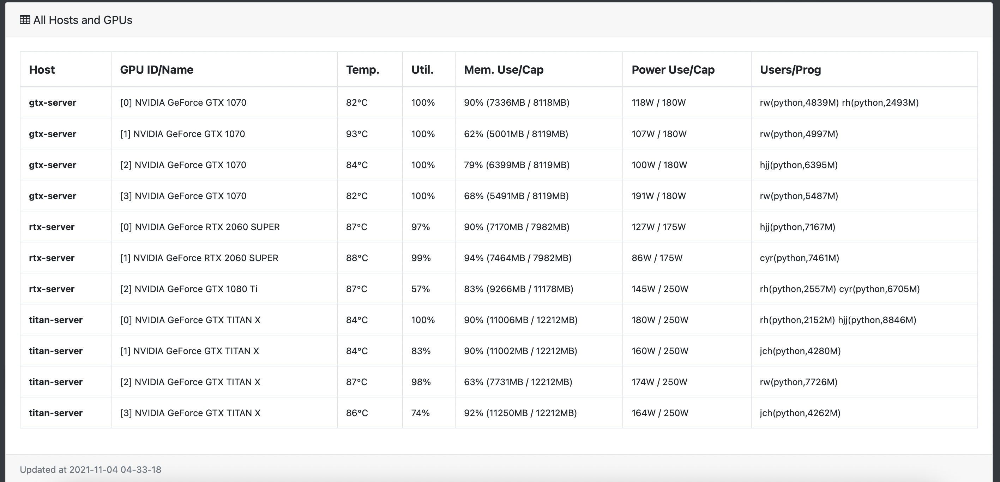

GPUView
=======

GPU is an expensive resource, and deep learning practitioners have to monitor the health and usage of their GPUs, such
as the temperature, memory, utilization, and the users. This can be done with tools like `nvidia-smi` and `gpustat` from
the terminal or command-line. Often times, however, it is not convenient to `ssh` into servers to just check the GPU
status.

GPUView is meant to mitigate this by running a lightweight web dashboard on top of
[gpustat](https://github.com/wookayin/gpustat). With GPUView one can monitor GPUs on a web browser. Moreover, multiple
GPU servers can be registered into one GPUView dashboard and all stats are aggregated and accessible from one place.


Setup
-----

```
$ pip install gevent 
$ pip install git+https://github.com/leftthomas/GPUView.git@master
```

Usage
-----

```
$ gpuview run --host 127.0.0.1
```

This will start the dashboard at `127.0.0.1:9988`. By default, `gpuview` runs at port `9988`, but these can be changed
by using `--host` and `--port`.

### Runtime options

There a few important options in `gpuview`, use `-h` to see them all.

* `run`                : Start `gpuview` dashboard server
  * `--host`           : IP address of host (e.g. 127.0.0.1)
  * `--port`           : Port number of host (default: 9988)
* `add`                : Register a GPU host
  * `--url`            : URL of GPU host (IP:Port, e.g. X.X.X.X:9988)
  * `--name`           : An optional readable name for the GPU host
* `remove`             : Remove a GPU host
  * `--url`            : URL of the GPU host to remove
* `hosts`              : Print all GPU hosts
* `-h`, `--help`       : Print help for command-line options

### Monitoring multiple hosts

To aggregate the stats of multiple machines, they can be registered to one dashboard using their address and the port
number running `gpustat`.

Register a host to monitor as follows:

```
$ gpuview add --url <ip:port> --name <name>
```

Remove a registered host as follows:

```
$ gpuview remove --url <ip:port>
```

Display all registered hosts as follows:

```
$ gpuview hosts
```

> Note: the `gpuview` service needs to run in all hosts that will be monitored.

> Tip: `gpuview` can be setup on a none GPU machine, such as laptops, to monitor remote GPU servers.


Detailed view of GPUs across multiple servers, this repo is base on [gpuview](https://github.com/fgaim/gpuview).



